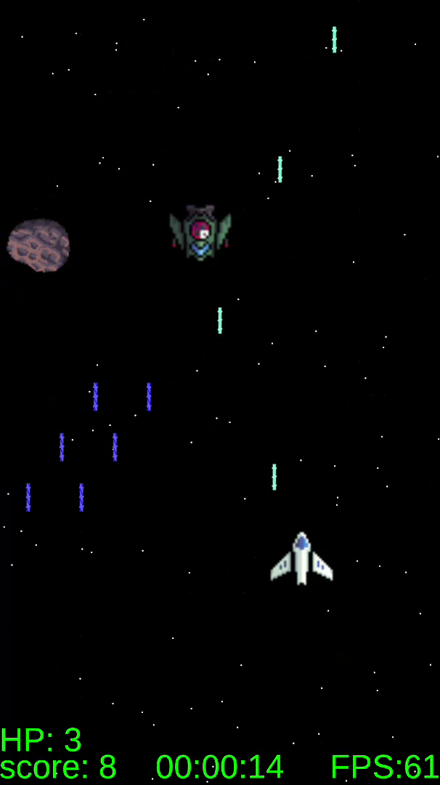

# quantum-superposition
A space shooter under development. 
Source code is private. All rights reserved.
 
 

 
<h2>
  GAMEPLAY: https://www.youtube.com/shorts/8zFs4kINNOY
</h2>
 
This is a top-down arcade-style space shooter.
The game is designed for mobile devices. 
The player controls a spacecraft in a fixed top-down view, where the environment gives the illusion of 
forward movement through incoming threats and will have a scrolling backgrounds. 
Enemy ships approach from the top of the screen and asteroids come from the left or right side. 
The player must survive by dodging, positioning, and shooting while managing multiple threats. 
The player ship has a maximum speed, preventing instant repositioning across the screen. 
This design choice ensures that positioning matters and avoids unrealistic “teleport-like” movement. 
 
The player and enemy ships automatically fire laser projectiles. 
 
- Lasers travel faster than ships, preventing self-collision during forward movement. 
- The player currently has 4 HP, but the system is scalable and can support higher values or upgrades. 
 
Enemy ships have multiple behaviors depending on their state and environment: 
 
- Standard enemies approach from the top and engage in direct combat. 
- Some enemies may attempt kamikaze attacks when in close proximity to the player, depending on probability-based behavior (RNG). 
- Enemies that avoid threats, may transition into a chasing behavior, following the player from behind. 
- In chasing, enemies may fire more carefully to avoid friendly fire situations, 
especially when allied ships are present ahead of them. 
 
The player has access to standard laser fire and a rocket for chasing enemies. 
 
A notable gameplay effect is the visual density of laser fire: 
 
- When moving forward, laser fire appears more concentrated. 
- When moving backward, laser fires have more spread out. 
- This creates a Doppler-like effect that can potentially be used strategically in gameplay (like in a bossfight). 

